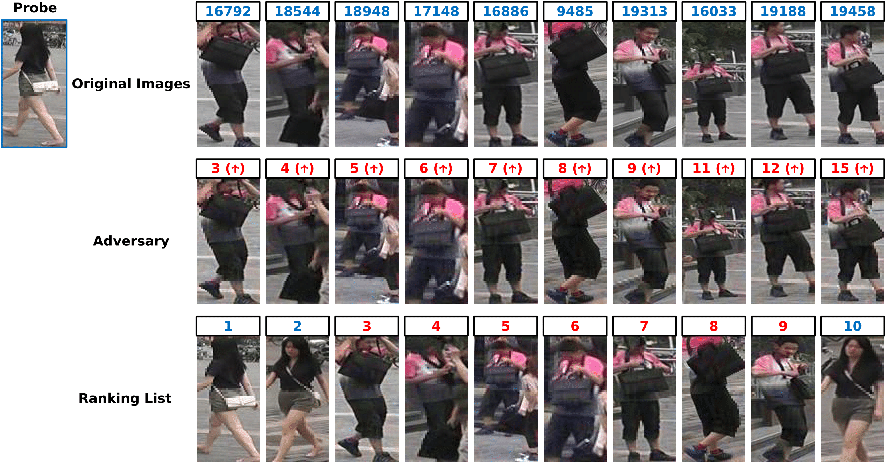

# Adversarial Metric Attack for Person Re-identification
By [Song Bai](http://songbai.site/), [Yingwei Li](http://yingwei.li/), [Yuyin Zhou](https://yuyinzhou.github.io/), [Qizhu Li](https://qizhuli.github.io/), [Philip H.S. Torr](http://www.robots.ox.ac.uk/~tvg/index.php).

## Introduction
This repository contains the code of the paper [Adversarial Metric Attack for Person Re-identification](https://arxiv.org/abs/1901.10650). It proposes adversarial metric attack, a parallel methodology to the existing adversarial classification attack. Adversarial metric attack can be used to attack metric-based systems like person re-identification and generate adversarial examples accordingly.

## Prerequisites
* Pytorch 0.4.1
* Numpy
* Python 2.7

## How to Run

```bash
sh adv.sh
```
## Experimental Setting

## Visualizations
### Visualizations of Ranking List
<p align="left">

</p>

<p align="left">

</p>
